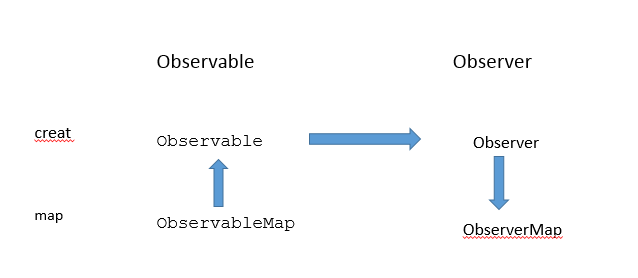

### 简单使用

1.引入RxJava2.0相关的类库
```
implementation 'io.reactivex.rxjava2:rxjava:2.0.1'
implementation 'io.reactivex.rxjava2:rxandroid:2.0.1'
```

2.创建被观察者
```
        //被观察者
        Observable novel= Observable.create(new ObservableOnSubscribe<String>() {
            @Override
            public void subscribe(ObservableEmitter<String> emitter) throws Exception {
                emitter.onNext("连载1");
                System.out.println("发送事件--连载1");
                emitter.onNext("连载2");
                System.out.println("发送事件--连载2");
                emitter.onNext("连载3");
                System.out.println("发送事件--连载3");
                emitter.onComplete();
                System.out.print("发送事件--已完成");
                emitter.onNext("连载4");
            }
        });

```

3.创建观察者
```
  //观察者
        Observer<String> reader=new Observer<String>() {
            @Override
            public void onSubscribe(Disposable d) {
                mDisposable=d;
                System.out.println("onSubscribe");
            }

            @Override
            public void onNext(String value) {
                if ("2".equals(value)){
                    mDisposable.dispose();
                    return;
                }
                System.out.println("onNext:"+value);
            }

            @Override
            public void onError(Throwable e) {
                System.out.println("onError="+e.getMessage());
            }

            @Override
            public void onComplete() {
                System.out.println("onComplete()");
            }
        };
        

```

4.被观察者订阅观察者
```
//被观察者订阅观察者
novel.subscribe(reader);

```

### 观察者模式分析

```
//观察者接口
public interface Observer<T> {

    void onSubscribe(Disposable d);

    void onNext(T value);

    void onError(Throwable e);

    void onComplete();
}

//用来连接ObservableEmitter和ObservableCreate
public interface ObservableOnSubscribe<T> {

    void subscribe(ObservableEmitter<T> e) throws Exception;
}

//类似于中间件Observable通过subscribe()方法里面调用ObservableEmitter的onNext()方法，ObservableEmitter的onNext()方法调用Observer的onNext()
public interface ObservableEmitter<T> {

    void setDisposable(Disposable d);

    boolean isDisposed();

    void onNext(T value);

    void onError(Throwable error);

    void onComplete();

}

//取消订阅的开关，取消后被观察者继续执行，观察者不在执行
public interface Disposable {

    //取消订阅
    void dispose();

    //获取是否取消订阅
    boolean isDisposed();
}


//被观察者的抽象类，里面有Observable实现类的创建，以及提供订阅的抽象方法
public abstract class Observable<T> {


    public static <T> Observable<T> create(ObservableOnSubscribe<T> source) {

        return new ObservableCreate<T>(source);
    }

    public final void subscribe(Observer<? super T> observer) {

        subscribeActual(observer);
    }

    public abstract void subscribeActual(Observer<? super T> observer);

}


//被观察者实现类
public class ObservableCreate<T> extends Observable<T>{

    final ObservableOnSubscribe<T> source;

    public ObservableCreate(ObservableOnSubscribe<T> source) {
        this.source = source;
    }

    @Override
    public void subscribeActual(Observer<? super T> observer){
        //创建ObservableEmitter的实现类
        CreateEmitter<T> parent = new CreateEmitter<T>(observer);
        //调用observer的onSubscribe的方法，表示订阅开始了
        observer.onSubscribe(parent);

        try {
            //调用ObservableOnSubscribe的subscribe()方法，
            source.subscribe(parent);
        } catch (Throwable ex) {
            parent.onError(ex);
        }
    }
    
  //ObservableEmitter Disposable的实现类
    static final class CreateEmitter<T> implements ObservableEmitter<T>, Disposable {

        final Observer<? super T> observer;

        boolean isDispose = false;

        CreateEmitter(Observer<? super T> observer) {
            this.observer = observer;
        }

        //在自身onNext方法里面调用observer.onNext(t);
        @Override
        public void onNext(T t) {
            if (t == null) {
                onError(new NullPointerException("onNext called with null. Null values are generally not allowed in 2.x operators and sources."));
                return;
            }
            if (!isDisposed()) {
                observer.onNext(t);
            }
        }

        @Override
        public void onError(Throwable t) {
            if (t == null) {
                t = new NullPointerException("onError called with null. Null values are generally not allowed in 2.x operators and sources.");
            }
            if (!isDisposed()) {
                try {
                    observer.onError(t);
                } finally {
                    dispose();
                }
            }
        }

        @Override
        public void onComplete() {
            if (!isDisposed()) {
                try {
                    observer.onComplete();
                } finally {
                    dispose();
                }
            }
        }

        @Override
        public void setDisposable(Disposable d) {
            isDispose = d.isDisposed();
        }


        @Override
        public void dispose() {
            isDispose = true;
        }

        @Override
        public boolean isDisposed() {
            return isDispose;
        }
    }
}

```
调用流程：

--> observable.subscribe(observer); 

--> subscribeActual(observer); 

--> observer.onSubscribe(createEmitter);  

--> source.subscribe(createEmitter);  

-->进入ObservableOnSubscribe.subscribe()方法，我们在这里调用emitter.onNext("连载1"); 

-->observer.onNext(t);

==如果我们中途调用disposable.dispose();则后续observer.onNext(t);observer.onComplete(t)都不会再调用。==
 
 
### 操作符

参考文章：
>https://www.jianshu.com/p/d997805b37d4

#### 调度操作符
##### subscribeOn 操作符
订阅在哪个线程执行（最初的事件发生在哪个线程）
```
.subscribeOn(Schedulers.io())//执行在io线程
    
```
##### observeOn 操作符
下一步观察者在哪个线程进行执行，可以多次调用
```
.observeOn(AndroidSchedulers.mainThread())//回调在主线程
```

#### 创建操作符

##### from操作符
将一个Iterable、一个Future、 或者一个数组，内部通过代理的方式转换成一个Observable。
```
Observable.fromArray("lpf", "GY").subscribe(mObserver);
```
##### just操作符

依次发送事件，just()参数有几个发送几个。
```
Observable.just("lpf", "GY").subscribe(mObserver);
```

##### interval操作符
创建以1秒为事件间隔发送整数序列的Observable

像这种在后台不断运行的Observable，需要在必要是取消订阅，用CompositeDisposable将每个CompositeDisposable添加到一起，释放时直接mCompositeDisposable.clear();

```
Observable.interval(0, 1, TimeUnit.SECONDS)
                .subscribeOn(Schedulers.io())
             .observeOn(AndroidSchedulers.mainThread())
             .subscribe(observer);
             
//mCompositeDisposable.add(disposable);
//mCompositeDisposable.clear();

```
##### range操作符

创建以发送范围内的整数序列的Observable
```
Observable.range(0, 3).subscribe(observer)
```
##### repeat操作符
创建一个以N次重复发送数据的Observable
```
Observable.range(0, 3).repeat(2).subscribe(observer);
```
#### 变换操作符

##### map操作符
将Observable转换为另一个Observable对象并发送

```
Observable.just(1,2,3,4)
                .map(new Function<Integer, Boolean>() {

                    @Override
                    public Boolean apply(Integer integer) throws Exception {

                        return integer%2==0;

                    }
                }).subscribe(observer);
```
##### flatMap操作符
将Observable发送的数据集合转换为Observable集合
==FlatMap对这些Observables发射的数据做的是合并(merge)操作，因此它们可能是交错的。==
```
Observable.just(1,2,3,4).flatMap(new Function<Integer, ObservableSource<String>>() {


            @Override
            public ObservableSource<String> apply(Integer s) throws Exception {
                return Observable.just("lpf--"+s);
            }
        }).subscribe(observer);
```
##### concatMap操作符
将Observable发送的数据集合转换为Observable集合
,解决了flatMap的交叉问题，将发送的数据连接发送
```
Observable.just(1,2,3,4).concatMap(new Function<Integer, ObservableSource<String>>() {


            @Override
            public ObservableSource<String> apply(Integer s) throws Exception {
                return Observable.just("lpf--"+s);
            }
        }).subscribe(observer);
```

##### cast操作符
源Observable发送的数据都强制转换为一个指定的类型
==需强调的一点是只能由父类对象转换为子类对象，否则会报错==
```
Observable.just(objectsArr).cast(String.class).subscribe(observer);
```


### map操作符分析

```
.map() 会得到一个ObservableMap对象，并且将调用此方法的Observable传到ObservableMap对象中。

observableMap.subscribe(observer)
1.先将传进来的observer封装成MapObserver,
2.再将之前传入的Observable.subscribe(MapObserver),
3.Observable进入自己的subscribeActual方法，调用MapObserver的onSubscribe，onNext方法，
4.MapObserver的onSubscribe，onNext方法里面调用最初的observer的onSubscribe，onNext方法。

```


### 配合动态权限申请
```
//引入库
    implementation 'com.tbruyelle.rxpermissions2:rxpermissions:0.9.4@aar'


 RxPermissions rxPermissions=new RxPermissions(this);
 
 //申请权限，返回一个结果，全部同意放回true，一个不同意放回false
        rxPermissions.request(Manifest.permission.READ_EXTERNAL_STORAGE,Manifest.permission.CALL_PHONE,Manifest.permission.INTERNET).subscribe(new Consumer<Boolean>() {
            @Override
            public void accept(Boolean aBoolean) throws Exception {
                if (aBoolean){
                    //申请的权限全部允许
                    Toast.makeText(MainActivity.this, "允许了权限!", Toast.LENGTH_SHORT).show();

                }else{
                    //只要有一个权限被拒绝，就会执行
                    Toast.makeText(MainActivity.this, "未授权权限，部分功能不能使用", Toast.LENGTH_SHORT).show();
                }
            }
        });
        

//申请权限，返回多个结果，不同权限不同结果
        rxPermissions.requestEach(Manifest.permission.CAMERA, Manifest.permission.READ_PHONE_STATE)
                .subscribe(new Consumer<Permission>() {
                    @Override
                    public void accept(Permission value) throws Exception {
                        if (value.granted) {
                            Log.e("lpf--111",value.granted+value.name);
                        } else if (value.shouldShowRequestPermissionRationale) {

                            Log.e("lpf--222",value.shouldShowRequestPermissionRationale+value.name);
                        } else {
                            Log.e("lpf--333", value.name);
                        }
                    }
                });        
        
    
```